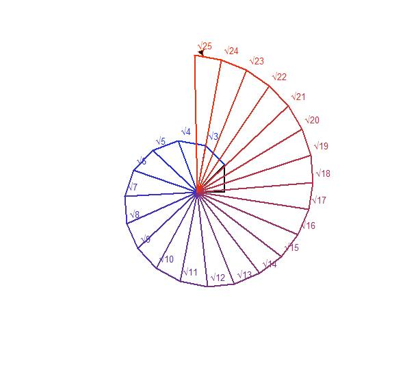

# Theodorus Spiral with Turtle Graphics

## English

This is a **simple and educational Python program** to draw the **Theodorus Spiral** (also called the Spiral of Square Roots) using Python's `turtle` graphics.

### Who is it for?

- Middle school students (grades 6-9)
- High school students
- Anyone who wants a step-by-step understanding of the Theodorus Spiral

### Features

- Step-by-step drawing of the spiral using triangles
- Gradually changing colors for better visualization
- Shows the square root values at each step (√2, √3, ...)
- Simple, easy-to-read code ideal for learning geometry and Python

### How to run

1. Install Python (3.x recommended)
2. Open the script in any Python IDE or editor
3. Run the script
4. Enter the number of steps when prompted

---

## فارسی

این یک برنامهٔ **آموزشی و سادهٔ پایتون** است که با استفاده از کتابخانهٔ `turtle`، **مارپیچ تئودوروس** (مارپیچ رادیکال‌ها) را رسم می‌کند.

### مناسب برای

- دانش‌آموزان راهنمایی (سال‌های 6 تا 9)
- دانش‌آموزان دبیرستان
- هر کسی که می‌خواهد مارپیچ تئودوروس را مرحله به مرحله درک کند

### ویژگی‌ها

- رسم مرحله به مرحله مارپیچ با مثلث‌های قائم‌الزاویه
- تغییر تدریجی رنگ‌ها برای وضوح بیشتر
- نمایش مقادیر رادیکال در هر مرحله (√2، √3، …)
- کد ساده و خوانا، مناسب برای یادگیری هندسه و پایتون

### نحوه اجرا

1. نصب Python نسخه 3 به بالا
2. باز کردن فایل کد در هر IDE یا ویرایشگر پایتون
3. اجرای برنامه
4. وارد کردن تعداد مراحل مورد نظر هنگام درخواست

---

